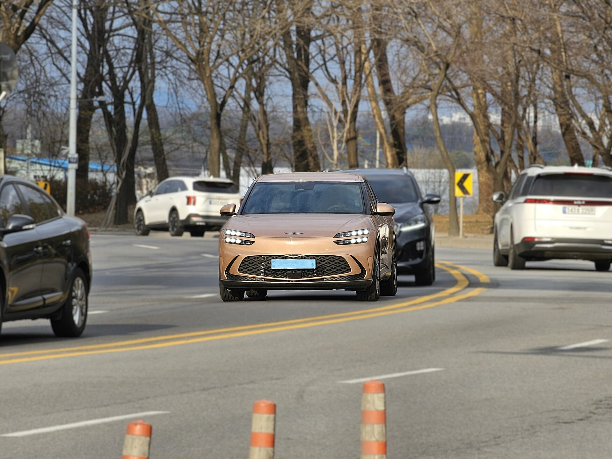
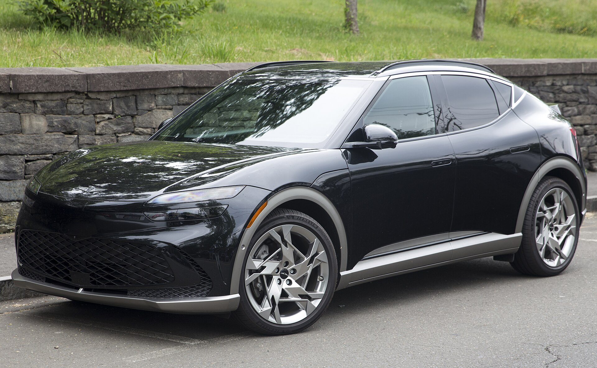
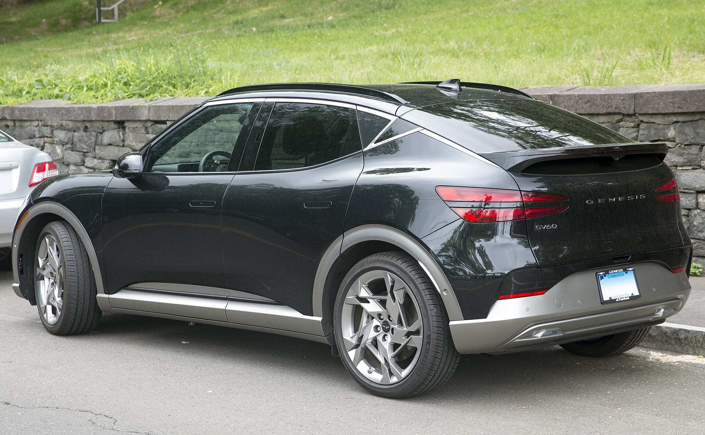
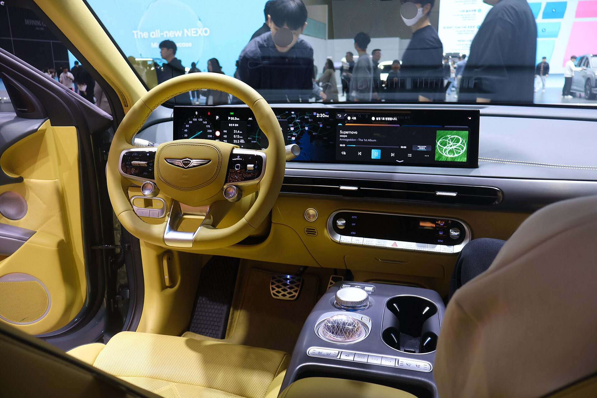

+++
title = '제네시스 GV60이 소형 프리미엄 SUV 차량 중 독보적인 이유'
date = 2026-06-24T09:00:00+09:00
draft = false
tags = ['제네시스', 'GV60', '전기차', 'SUV', '자동차']
categories = ['EV']
+++

소형 프리미엄 SUV 시장은 최근 몇 년 사이 가장 치열한 전장이 되었습니다. 그 안에서 제네시스 GV60은 단순히 "전기차로 나온 SUV"가 아니라, 브랜드의 전동화 정체성을 가장 압축적으로 보여주는 모델로 자리잡았습니다. 오늘은 GV60이 동급 소형 프리미엄 SUV들과 비교해 어떤 점에서 독보적인 위치를 차지하고 있는지 정리해 보겠습니다.

## 1. 전용 전기차 플랫폼에서 나온 완성도

GV60은 내연기관 차량을 개조한 파생 전기차가 아니라, 처음부터 전기차만을 위해 설계된 E-GMP 플랫폼 위에서 태어났습니다. 배터리를 차체 바닥에 평평하게 깔아 무게중심을 낮추고, 실내 공간을 극대화한 구조는 동급의 기존 내연기관 기반 파생 전기 SUV들이 따라오기 어려운 부분입니다. 같은 플랫폼을 쓰는 아이오닉5, EV6와 기본기를 공유하면서도, 제네시스만의 디자인과 편의 사양으로 차별화한 점이 GV60의 핵심 경쟁력입니다.

| | |
|---|---|
|  |  |

전면부는 제네시스의 상징인 두 줄 헤드램프(쿼드램프)와 크레스트 그릴이 강한 존재감을 드러내고, 후면부는 매끈하게 이어지는 테일램프 라인으로 전기차다운 미래지향적 이미지를 완성합니다.

## 2. 프리미엄 브랜드 감성을 담은 디테일

GV60에서 가장 화제가 되는 것은 시동을 걸면 회전하며 모습을 드러내는 '크리스탈 스피어' 변속 다이얼입니다. 단순한 기어 노브가 아니라, 전기차 특유의 정적인 실내에 기계적 무드를 더하는 장치로, 동급 경쟁 모델에서는 보기 힘든 디테일입니다. 여기에 지문 인증을 통한 시동 및 결제 기능, 얼굴 인식 등 보안·편의 기술이 더해지면서 단순한 이동 수단이 아니라 프리미엄 모빌리티 경험을 제공합니다.

## 3. 빠른 충전과 일상 주행의 균형

GV60은 800V급 고전압 충전 아키텍처를 지원해, 동급 차량 대비 충전 시간을 크게 줄일 수 있다는 점도 강점입니다. 장거리 이동이 많은 사용자에게는 충전소에서 머무는 시간이 줄어든다는 것이 체감 효과가 큰 부분이며, 듀얼 모터 사륜구동 모델의 경우 일상 주행에서도 안정적인 트랙션과 즉각적인 가속감을 제공해 '전기차다운 재미'와 '프리미엄 SUV다운 안정감'을 동시에 만족시킵니다.

## 4. 가격 대비 포지셔닝

수입 프리미엄 브랜드의 소형 전기 SUV들과 비교했을 때, GV60은 비슷하거나 그 이상의 편의·안전 사양을 갖추면서도 가격 경쟁력에서 우위를 점하고 있습니다. 국내 서비스망과 보증 정책 또한 수입 브랜드 대비 접근성이 높아, 실사용 측면에서의 만족도가 높다는 평가가 많습니다.

## 마무리

GV60은 단순히 "전기차로 나온 소형 SUV" 한 대가 아니라, 전용 플랫폼의 완성도, 브랜드만의 디테일, 충전·주행 성능, 합리적인 가격대까지 여러 요소가 맞물려 동급에서 보기 드문 종합 경쟁력을 갖춘 모델입니다. 다음 글에서는 GV60과 경쟁 모델들을 좀 더 구체적인 수치로 비교해 보겠습니다.

---

사진 출처: Wikimedia Commons (CC BY-SA 3.0 / 4.0) — Mr.choppers, Damian B Oh, Treeinkr
